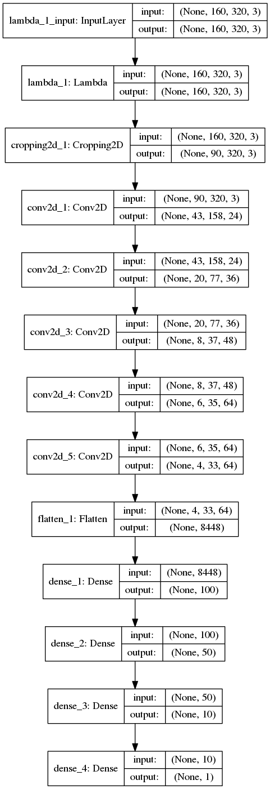
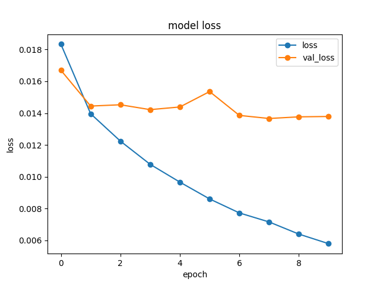

# Behavioral Cloning

The goals / steps of this project are the following:
* Use the simulator to collect data of good driving behavior
* Build, a convolution neural network in Keras that predicts steering angles from images
* Train and validate the model with a training and validation set
* Test that the model successfully drives around track one without leaving the road
* Summarize the results with a written report

### Submitted Files

**Because I have trained model in keras==2.0.4 (not keras==1.2.1),
pleas install keras==2.0.4 to run the following command**

```
$ pip install keras==2.0.4
$ python drive.py model.h5
$ pip install keras==1.2.1 # to back to original environment
```

* model.py containing the script to create and train the model
* drive.py for driving the car in autonomous mode
* model.h5 containing a trained convolution neural network
* writeup_report.md or writeup_report.pdf summarizing the results

* data_generator.py for keras's fit_generator
* yaml_to_h5.py for convert saved_weight.yaml to saved_weight.h5(==model.h5)

Using the Udacity provided simulator and my drive.py file, the car can be driven autonomously around the track by executing

### Model Architecture and Training Strategy

#### 1. model architecture

base architecture is [NVIDIA model](https://arxiv.org/abs/1604.07316)


After trying experiments, I made the architecture more simple to reduce overfitting.

the final architecure is the following:

| Layer         	|     Description	        		|
|:---------------------:|:---------------------------------------------:|
| Input         	| 160x320x3 RGB image   			|
| Normalization     	| lambda x: x/127.5 - 1. , outputs 160x320x3 	|
| Cropping		| discard top50pix bottom20px, outputs 90x320x3	|
| Convolution 5x5     	| 2x2 stride, valid padding, ReLU, 24channel 	|
| Convolution 5x5     	| 2x2 stride, valid padding, ReLU, 36channel	|
| Convolution 5x5     	| 2x2 stride, valid padding, ReLU, 48channel	|
| Convolution 3x3     	| 1x1 stride, valid padding, ReLU, 64channel	|
| Convolution 3x3     	| 1x1 stride, valid padding, ReLU, 64channel	|
| Fully connected	| outputs 100, ReLU				|
| Fully connected	| outputs 50, ReLU				|
| Fully connected	| outputs 10, ReLU				|
| Fully connected	| outputs 1, tanh				|
|			|						|



#### 2. attempts to reduce overfitting

* I reduced 1 fully-connected layer from nvidia-model
* cropping made the number of parameters smaller
* data augumentation (horizontal flipping)
* data augumentation (3 car mounted camera(left, center, right) and corrected ground truth angle)

#### 3. parameters

* adam (learning rate = 0.0001)
* batch size = 196
* num_epochs = 10
* correction value for 3 car mounted camera = 0.2(left), 0(center), -0.2(right)

#### 4. training dataset

I have downloaded sample datasets from official Udacity's lecture page,
because collected dataset on my macbook-pro by using trackpad is not good.
(I am poor at driving in simulator)

I use data augumentation techinique:
* horizontal flipping
* 3 car mounted camera(left, center, right) and corrected ground truth angle

#### more technique I used

* train_test_split
* shuffling dataset
* data_generator (Keras's API)

At the end of the process, the vehicle is able to drive autonomously around the track without leaving the road.

#### training logs


